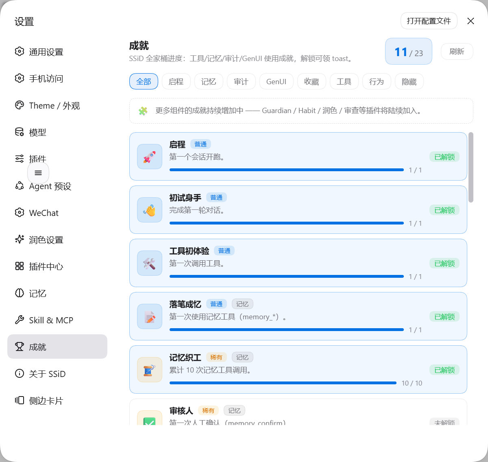

# dsh-achievements 路 SSiD 全家桶成就插件

[DeepSeek Harness](https://github.com/deepseek-ai/deepseek-harness)（DSS）全局进度成就系统：监听 session / tool 事件，把工具调用、记忆/模板库工具、上下文审计、token 用量、GenUI 渲染等行为折成成就进度，解锁时 toast + 设置页「成就」面板（全景：含 GenUI 类别的融合视图）。

## 特性

- **18 个成就**、7 类别（启程 / 记忆 / 审计 / GenUI / 工具 / 行为 / 隐藏），稀有度覆盖 普通 → 传说；隐藏成就（如 夜猫子、自我指涉、亿万富翁）解锁前显示「？？」
- **分层面板**：工具名、事件类型、token 计数、当天时刻等叶级标量——**绝不读取消息正文、文件内容或错误详情**
- **GenUI 融合**：client 读取 genui 插件自身的计数存储（`dsh.genui.achievements`），上报合并——全景页与 genui 成就页数据同源、互不重复计数
- **本地持久化**：`$DSH_HOME/achievements/state.json`，重启保留
- **HTTP 通道**：`/achievements/api`（list / recent / clear / genui-merge），信任围栏同 dsh-memory 的 `/memory/api`
- **模型工具**：`list_achievements`（只读进度查询）

## 截图

装完后在设置里多出「成就」一项，展示 SSiD 全家桶使用进度：

**入口：** 设置 → 成就

| 设置入口与面板 |
|---|
|  |

## 接入
```bash
dsh plugin add @max-null/dsh-achievements
```

设置页 → 「成就」；首次解锁 toast 在页面右下角弹出。

## 配置

无（零配置；`$DSH_HOME` 缺省 `~/.dsh`）。

## 设计纪律

成就的意义在「激励探索」而非「统计监控」：所有计数只保留推理所需的叶级标量；卸载/清空（`clear`）随时可重置；深度内容（正文/文件）不在任何成就的判定路径上。
